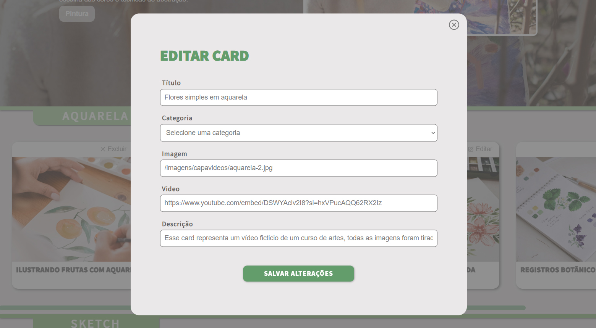

# Challenge ONE  | React Aluraflix


## Descrição

O projeto **Artflix** (Aluraflix) é parte do desafio da trilha de formação Front End do programa ONE (Oracle Next Education).
O objetivo é criar uma página de exibição de vídeos, separados por diferentes categorias, permitindo a adição, edição e remoção dos vídeos do catálogo. Este projeto visa demonstrar o uso de tecnologias e ferramentas aprendidas durante o curso, como React, React Router DOM e Json-server, além da manipulação de requisições e formulários.

## Funcionalidades

- Exibição de vídeos por categorias
- Adição de novos vídeos ao catálogo
- Edição de vídeos existentes
- Remoção de vídeos do catálogo
- Responsividade para dispositivos móveis

## Tecnologias Utilizadas

- [React](https://reactjs.org/)
- [React Router DOM](https://reactrouter.com/)
- [Json-server](https://github.com/typicode/json-server)

## Pré-requisitos

Antes de começar, certifique-se de ter os seguintes softwares instalados em sua máquina:

- [Node.js](https://nodejs.org/)
- [npm](https://www.npmjs.com/)

## Instalação

1. Clone este repositório:
   ```bash
   git clone https://github.com/seu-usuario/aluraflix.git
   cd aluraflix

2. Instale as dependências:
   ```bash
   npm instal

3. Inicie o Json-server:

   ```bash
    npx json-server --watch videos.json

4. Inicie o servidor de desenvolvimento:

   ```bash
    npm start


## Telas


Modal de Edição


Criação de novo vídeo


Responsividade
